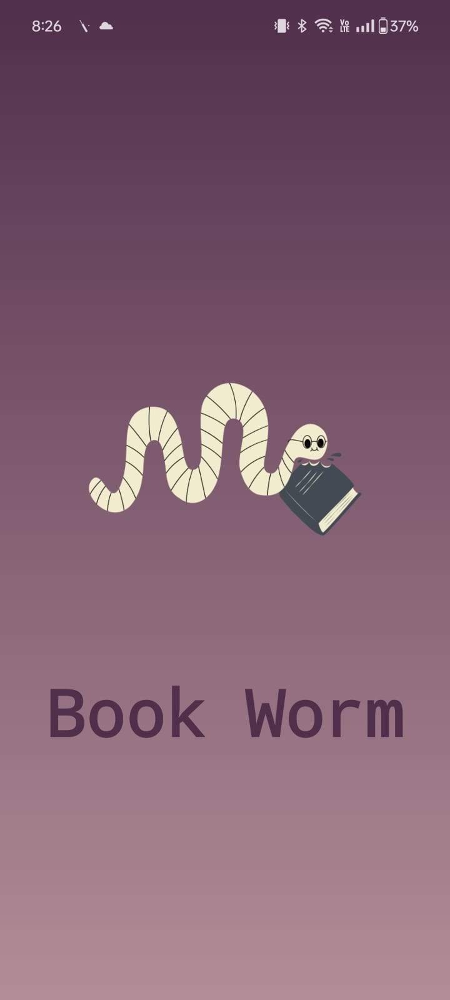
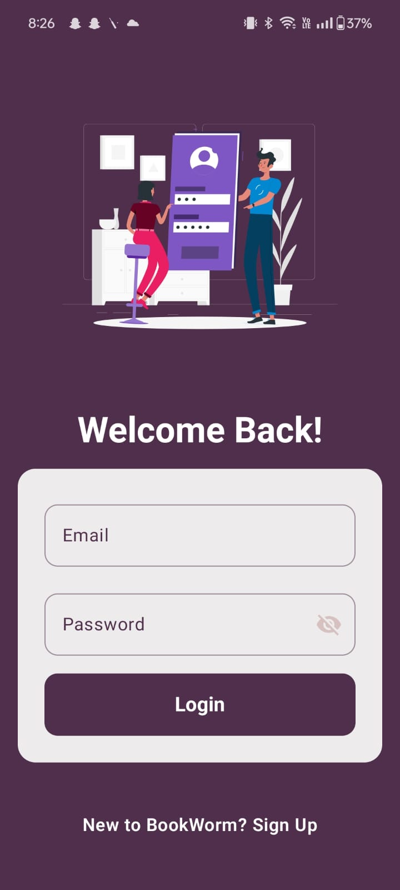
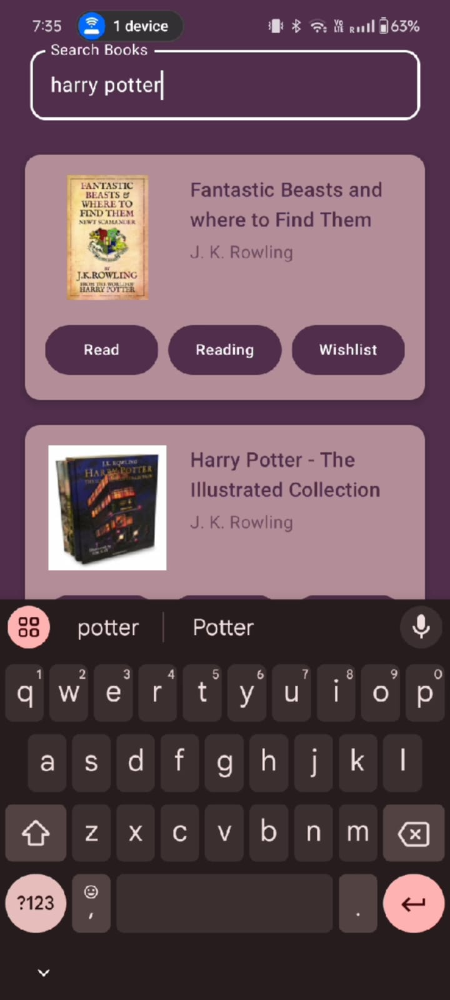

# BookWorm

BookWorm is an Android app designed to enhance your reading experience. Developed primarily in Kotlin, with some JavaScript, it offers a range of features to help you manage and enjoy your book collection.

## Features

* Manage your book collection with ease
* Track reading progress and set goals
* Discover new books and authors
* User-friendly interface with intuitive navigation

📸 Example:

<p align="center">
  
  
</p>
<p align="center">
  
  
</p>

## Installation

### Android

To build and run the Android app, follow these steps:

1. Clone the repository:

   ```bash
   git clone https://github.com/Yagyansh02/BookWorm.git
   ```
2. Open the project in Android Studio.
3. Build and run the app on an emulator or a physical device.

### Backend

The backend is developed using Node.js and Express. To set up and run the backend server:

1. Navigate to the `backend` directory:

   ```bash
   cd backend
   ```
2. Install the dependencies:

   ```bash
   npm install
   ```
3. Start the server:

   ```bash
   npm start
   ```

## Dependencies

### Android

* Kotlin
* AndroidX
* Dagger Hilt
* Jetpack Compose
* Navigation Component
* Retrofit

### Backend

* bcrypt
* cors
* dotenv
* express
* jsonwebtoken
* mongoose
* validator
* nodemon (development)

## Usage

1. Launch the Android app.
2. Use the app to manage your book collection, track reading progress, and discover new books.
3. The backend server handles user authentication and data storage.

## License

This project is licensed under the MIT License.

---

Feel free to enhance and update this README file as needed.
